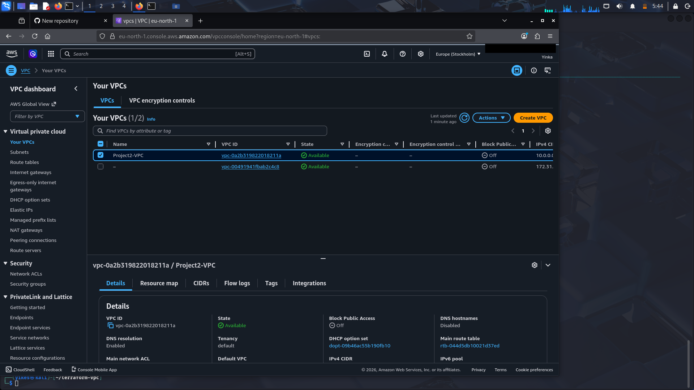
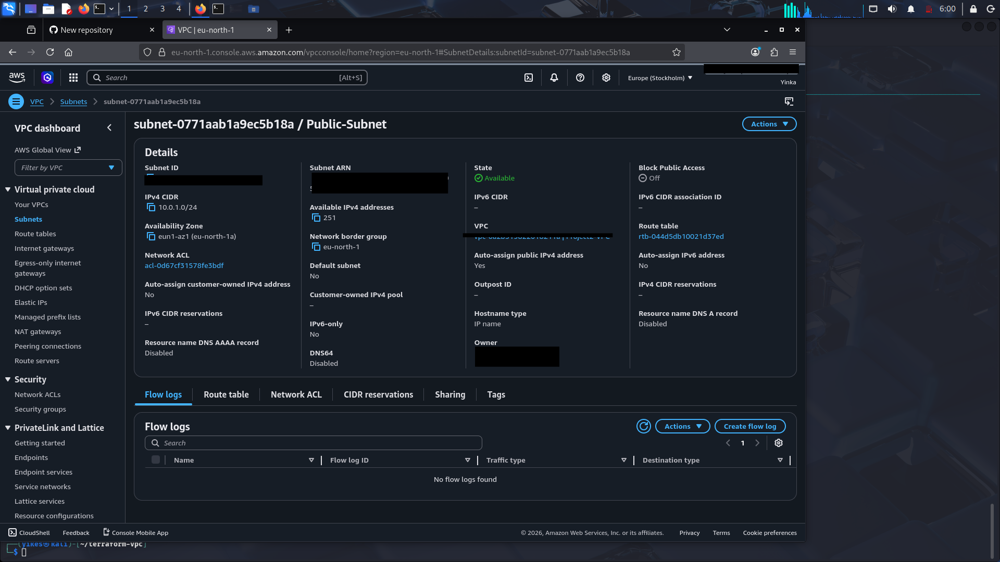
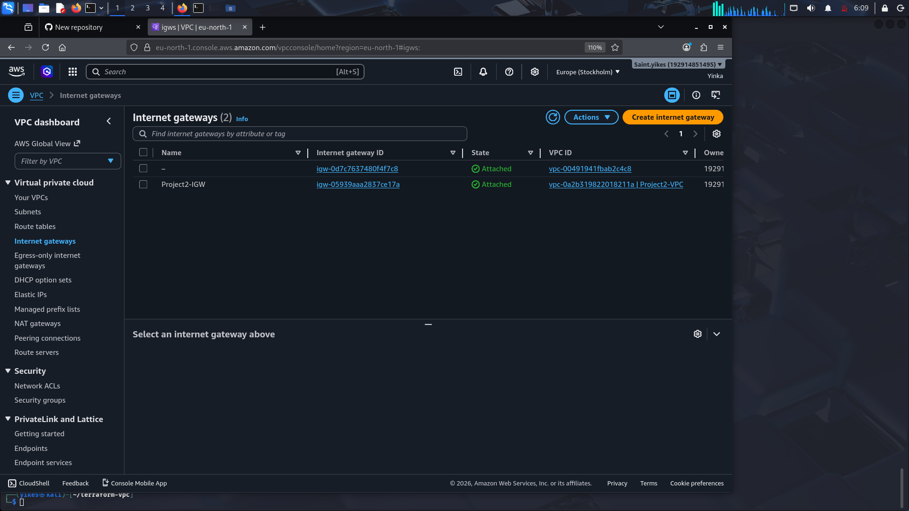
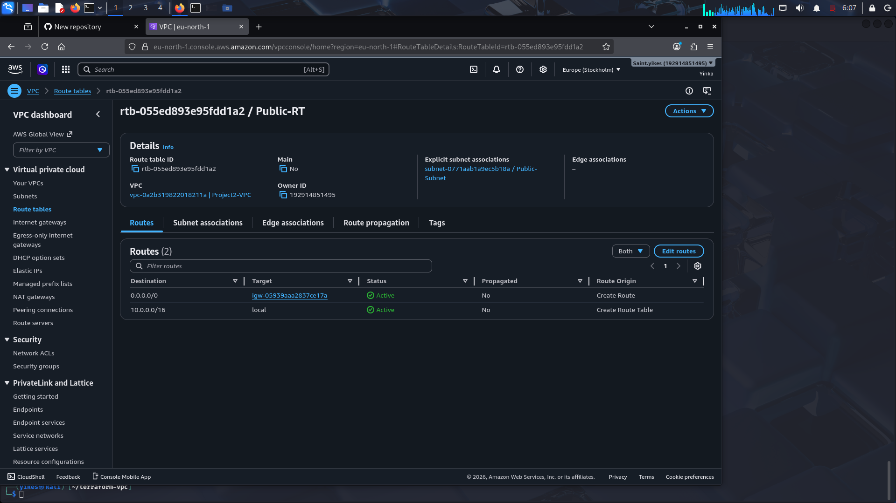
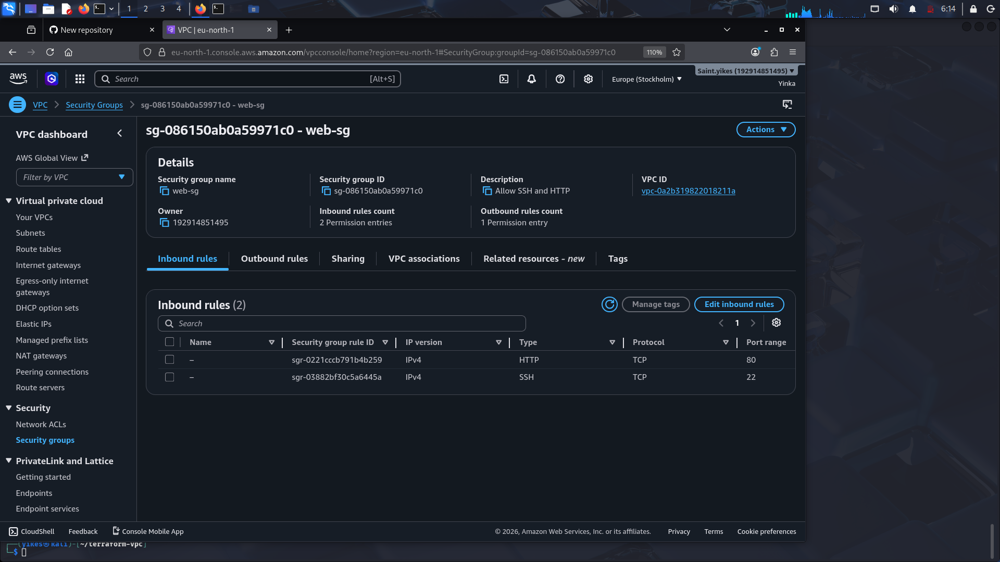
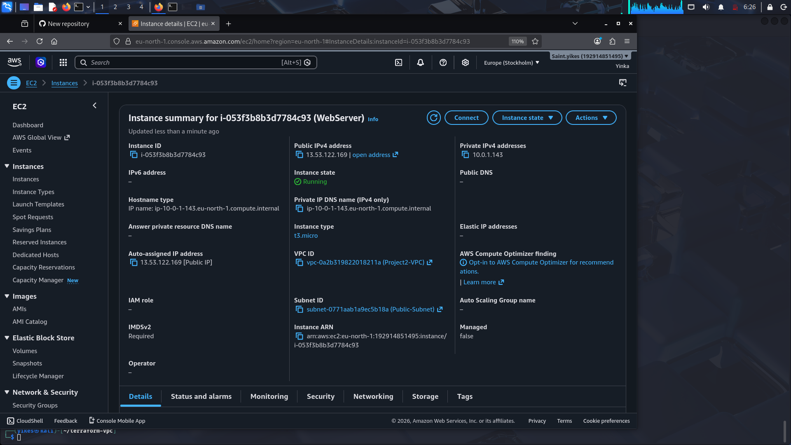
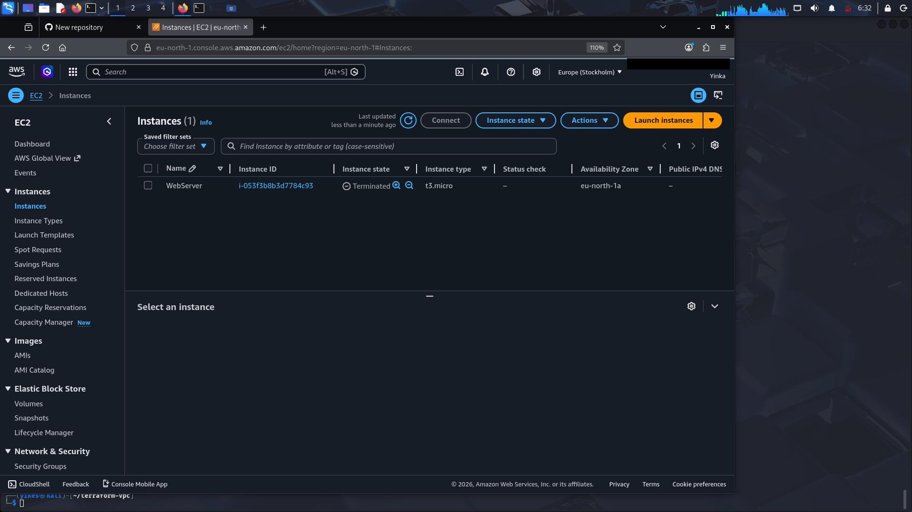

# Terraform AWS VPC + EC2 Project

## 📌 Project Overview
This project provisions a complete AWS networking environment using **Terraform**. It demonstrates how to build a secure and scalable infrastructure by creating a custom **Virtual Private Cloud (VPC)**, configuring networking components, applying security rules, and deploying an **EC2 instance** inside the VPC.

---

## ⚙️ Tools & Technologies
- **Terraform** (Infrastructure as Code)
- **AWS VPC** (Virtual Private Cloud)
- **AWS Subnets**
- **AWS Internet Gateway & Route Tables**
- **AWS Security Groups**
- **AWS EC2 Instance**
- **Linux Terminal**

---

## 🛠️ Infrastructure Workflow

### Step 1: VPC
- Created a custom VPC with CIDR block `10.0.0.0/16`.
- Verified in AWS Console.
 

---

### Step 2: Public Subnet
- Added a public subnet (`10.0.1.0/24`) inside the VPC.
- Configured to auto‑assign public IPs for instances.
 

---

### Step 3: Internet Gateway + Route Table
- Created an Internet Gateway (`Project2-IGW`).
- Configured a Route Table (`Public-RT`) with a default route to the internet (`0.0.0.0/0`).
- Associated the Route Table with the Public Subnet.
 

---

### Step 4: Security Group
- Created a Security Group (`Web-SG`) inside the VPC.
- Allowed inbound SSH (port 22) for remote login.
- Allowed inbound HTTP (port 80) for web traffic.
- Allowed all outbound traffic.
 

---

### Step 5: EC2 Instance
- Launched an EC2 instance (`WebServer`) inside the Public Subnet.
- Attached the Security Group (`Web-SG`) to the instance.
- Verified instance has a public IP and is running successfully.
 

---

## 🧹 Cleanup
To avoid charges, all resources were destroyed after testing:

terraform destroy

